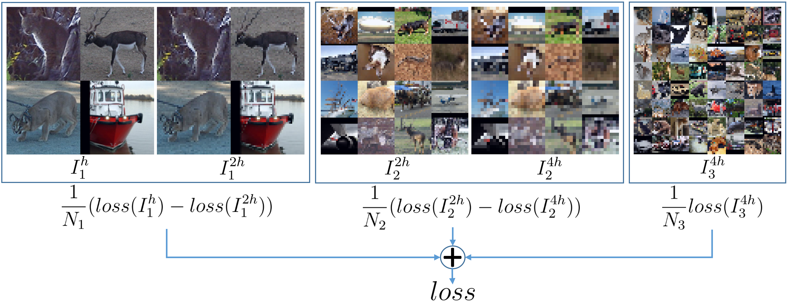

# Multiscale Training of Convolutional Neural Networks

A PyTorch implementation of multiscale gradient estimation for efficient training of image reconstruction convolutional neural network models. This repository provides training scripts and utilities for denoising, deblurring, inpainting, and super-resolution using single-scale, multiscale, and full multiscale training strategies that significantly reduce computational cost during training while maintaining model performance.

<p align="center">
  
</p>

Illustration of our Multiscale Gradient Estimation (MGE) algorithm. This figure shows a schematic of a 3-level MGE algorithm with resolutions $h$ (finest), $2h$, and $4h$ (coarsest) with batch sizes $N_3 > N_2 > N_1$.

## 📋 Table of Contents
- [Installation](#installation)
- [Data Setup](#data-setup)
- [Repository Structure](#repository-structure)
- [Training](#training)
  - [Denoising](#denoising)
  - [Deblurring](#deblurring)
  - [Inpainting](#inpainting)
  - [Super-Resolution](#super-resolution)
- [Training Modes](#training-modes)
- [Model Architectures](#model-architectures)
- [Output and Logs](#output-and-logs)
- [Key Features](#key-features)
- [Citation](#citation)

---

## 🚀 Installation

1. Clone the repository:
```bash
git clone https://github.com/yourusername/multiscale-gradient-estimation.git
cd multiscale-gradient-estimation
```

2. Create a virtual environment (recommended):
```bash
conda create -n multiscale python=3.9
conda activate multiscale
```

3. Install dependencies:
```bash
pip install -r requirements.txt
```

**Requirements:**
- PyTorch >= 1.10
- torchvision
- numpy
- pandas
- tqdm
- matplotlib

---

## 📂 Data Setup

### Configure Data Directory

Before training, you need to specify where your datasets are stored. Open `multiscale/datasets.py` and modify the `MAIN_DATA_DIR` variable:

```python
# multiscale/datasets.py (line 7)
MAIN_DATA_DIR = '/path/to/your/data'  # Change this to your data directory
```

### Expected Directory Structure

Organize your datasets in the following structure:

```
/path/to/your/data/
├── cifar-10-batches-py/          # CIFAR-10 (auto-downloaded by torchvision)
├── stl10_binary/                 # STL-10 (download manually or auto-download)
├── CelebA/
│   ├── img_align_celeba/         # CelebA images
│   ├── list_attr_celeba.txt      # CelebA attributes file
│   └── list_eval_partition.txt   # CelebA train/val/test split
└── Urban100/
    ├── low_res_train.pt          # Low-resolution training images
    ├── high_res_train.pt         # High-resolution training images
    ├── low_res_test.pt           # Low-resolution test images
    └── high_res_test.pt          # High-resolution test images
```

### Dataset Downloads

**CIFAR-10**: Automatically downloaded by torchvision on first use.

**STL-10**: Automatically downloaded by torchvision on first use, or download from [STL-10 website](https://cs.stanford.edu/~acoates/stl10/).

**CelebA**: Download from [CelebA website](http://mmlab.ie.cuhk.edu.hk/projects/CelebA.html) or [Kaggle](https://www.kaggle.com/datasets/jessicali9530/celeba-dataset):
```bash
# Example download structure
cd /path/to/your/data
mkdir -p CelebA
cd CelebA
# Download img_align_celeba.zip, list_attr_celeba.txt, list_eval_partition.txt
unzip img_align_celeba.zip
```

**Urban100**: For super-resolution, you need to prepare low-resolution and high-resolution image pairs. The dataset should be saved as PyTorch tensors (.pt files) containing image patches. Place them in `/path/to/your/data/Urban100/` with the names shown in the directory structure above.

---

## 📁 Repository Structure

```
multiscale-gradient-estimation/
├── multiscale/                   # Core package
│   ├── __init__.py              # Package exports
│   ├── gradients.py             # Multiscale gradient computation
│   ├── models.py                # Model architectures (ResNet, UNet, SRParaConvNet)
│   ├── datasets.py              # Dataset loaders (CIFAR10, STL10, CelebA, Urban100)
│   ├── forward_operators.py     # Forward operators (blur, corruption)
│   └── utils.py                 # Training utilities (logging, checkpointing)
├── train_denoising.py           # Training script for denoising
├── train_deblurring.py          # Training script for deblurring
├── train_inpainting.py          # Training script for inpainting
├── train_superresolution.py     # Training script for super-resolution
├── requirements.txt             # Python dependencies
├── results/                     # Training outputs (created automatically)
│   ├── logs/                    # Training/validation logs
│   └── models/                  # Model checkpoints
└── README.md                    # This file
```

---

## 🏋️ Training

All training scripts follow a consistent interface with the following arguments:

| Argument | Type | Choices | Default | Description |
|----------|------|---------|---------|-------------|
| `--mode` | str | `single`, `multiscale`, `fullmultiscale` | `single` | Training mode |
| `--network` | str | `unet`, `resnet` | `unet` | Network architecture |
| `--dataset` | str | Task-specific | - | Dataset to use |
| `--run_id` | int | - | `1` | Experiment run ID |
| `--device_id` | int | - | `0` | CUDA device ID |
| `--seed` | int | - | `42` | Random seed |

### Denoising

Train models to denoise images corrupted with Gaussian noise.

**Datasets:** CIFAR-10, CelebA

```bash
# Single-scale training with UNet on CIFAR-10
python train_denoising.py --mode single --network unet --dataset cifar10 --run_id 0 --device_id 0

# Multiscale training with UNet on CIFAR-10
python train_denoising.py --mode multiscale --network unet --dataset cifar10 --run_id 1 --device_id 0

# Full multiscale training with ResNet on CelebA
python train_denoising.py --mode fullmultiscale --network resnet --dataset celeba --run_id 2 --device_id 1
```

### Deblurring

Train models to deblur images corrupted with Gaussian blur (σ = [3, 3]).

**Datasets:** STL-10 (recommended), CIFAR-10, CelebA

```bash
# Single-scale training with UNet on STL-10
python train_deblurring.py --mode single --network unet --dataset stl10 --run_id 0 --device_id 0

# Multiscale training with UNet on STL-10
python train_deblurring.py --mode multiscale --network unet --dataset stl10 --run_id 1 --device_id 0

# Full multiscale training with ResNet on STL-10
python train_deblurring.py --mode fullmultiscale --network resnet --dataset stl10 --run_id 2 --device_id 1

# Alternative: Using CIFAR-10 for deblurring
python train_deblurring.py --mode single --network unet --dataset cifar10 --run_id 3 --device_id 0
```

### Inpainting

Train models to inpaint images with corrupted regions.

**Datasets:** CelebA (recommended), CIFAR-10

```bash
# Single-scale training with UNet on CelebA
python train_inpainting.py --mode single --network unet --dataset celeba --run_id 0 --device_id 0

# Multiscale training with UNet on CelebA
python train_inpainting.py --mode multiscale --network unet --dataset celeba --run_id 1 --device_id 0

# Full multiscale training with ResNet on CelebA
python train_inpainting.py --mode fullmultiscale --network resnet --dataset celeba --run_id 2 --device_id 1

# Alternative: Using CIFAR-10 for inpainting
python train_inpainting.py --mode single --network unet --dataset cifar10 --run_id 3 --device_id 0
```

### Super-Resolution

Train models to upsample low-resolution images by 2x.

**Datasets:** Urban100

**Additional Arguments:**
- `--patch_size`: Patch size for training (default: 64)
- `--train_patches`: Number of patches per training image (default: 10)
- `--test_patches`: Number of patches per test image (default: 2)

```bash
# Single-scale training with SRNet on Urban100
python train_superresolution.py --mode single --network srnet --dataset urban100 --run_id 0 --device_id 0

# Multiscale training with SRNet on Urban100
python train_superresolution.py --mode multiscale --network srnet --dataset urban100 --run_id 1 --device_id 0

# Full multiscale training with ResNet on Urban100
python train_superresolution.py --mode fullmultiscale --network resnet --dataset urban100 --run_id 2 --device_id 1

# Custom patch settings
python train_superresolution.py --mode single --network srnet --dataset urban100 --patch_size 64 --train_patches 10 --run_id 3 --device_id 0
```

---

## 🔧 Training Modes

### Single Scale (`--mode single`)
- **Description**: Standard training at the finest resolution only
- **Levels**: 0 (fine mesh only)
- **Batch size**: 16
- **Use case**: Baseline comparison

### Multiscale (`--mode multiscale`)
- **Description**: Fixed multiscale training with gradient differences across 3 levels
- **Levels**: 3 (coarse to fine)
- **Batch size**: 16 (constant across levels)
- **Use case**: Improved convergence with multiscale gradients

### Full Multiscale (`--mode fullmultiscale`)
- **Description**: Full Multscale cycle with hierarchical training
- **Levels**: 0-3 (adaptive)
- **Batch size**: Adaptive (16 × 2^(3-j) at level j)
- **Use case**: Best performance, memory-efficient for high-resolution

---

## 🏗️ Model Architectures

### UNet (`--network unet`)
- **Architecture**: U-Net with skip connections and timestep embedding
- **Configuration**:
  - Input/output channels: 3 (RGB)
  - Model channels: 32
  - Channel multipliers: (1, 2, 4)
  - Dropout: 0.5
  - Residual blocks: 1 per level

### ResNet (`--network resnet`)
- **Architecture**: Residual network with timestep embedding
- **Configuration**:
  - Input/output channels: 3 (RGB)
  - Hidden channels: 128
  - Number of layers: 2
  - Time embedding: Enabled

### SRParaConvNet (`--network srnet`)
- **Architecture**: Lightweight CNN for super-resolution (2x upscaling)
- **Configuration**:
  - Input/output channels: 3 (RGB)
  - Hidden channels: 64
  - Layers: 4 convolutional layers with layer normalization
  - Residual learning: output = model(bilinear_upsample(input)) + bilinear_upsample(input)

---

## 📊 Output and Logs

All training outputs are saved to the `./results` directory:

```
results/
├── logs/
│   ├── {task}_{dataset}_{network}_{mode}_run{id}_train.csv
│   └── {task}_{dataset}_{network}_{mode}_run{id}_valid.csv
└── models/
    └── {task}_{dataset}_{network}_{mode}_run{id}_best.pt
```

### Log Files
- **Training logs**: Iteration-wise training loss and time
- **Validation logs**: Iteration-wise validation loss (and SSIM for inpainting)

### Model Checkpoints
- Only the **best model** (lowest validation loss) is saved
- Checkpoint includes: model state, optimizer state, level, iteration, train loss, validation loss

### Experiment Naming Convention
```
{task}_{dataset}_{network}_{mode}_run{id}
```

**Examples:**
- `denoising_cifar10_unet_single_run0`
- `deblurring_stl10_resnet_multiscale_run1`
- `inpainting_celeba_unet_fullmultiscale_run2`
- `superresolution_urban100_srnet_single_run0`

---

## ✨ Key Features

### Multiscale Gradient Computation
The core innovation lies in computing gradients across multiple resolution scales:
- **Single scale**: Standard gradient computation at finest resolution
- **Multiscale**: Gradient differences between consecutive scales (coarse correction)
- **Full multiscale**: Hierarchical Full-Multiscale cycle with level-dependent batch sizes

### Forward Operators
Task-specific corruption models:
- **Denoising**: Identity operator + Gaussian noise
- **Deblurring**: FFT-based Gaussian blur (σ = [3, 3])
- **Inpainting**: Random box corruption with noise interpolation
- **Super-Resolution**: Bilinear downsampling + residual refinement

### Dynamic Batch Sizing
Intelligent batch size adaptation:
- Adjusts based on training mode and hierarchy level
- Memory-efficient training for high-resolution images
- Full multiscale mode: larger batches on coarse levels, smaller on fine levels

### Best Model Checkpointing
- Validation-based model selection
- Saves only the best model (not all checkpoints)
- Reduces storage requirements

### Time Embedding
- Timestep-conditional networks for diffusion-style training
- Random timestep sampling: t ~ Uniform(0, 0.1)
- Interpolation: x_t = (1-t)x_corrupted + t·noise

---

## 📝 Citation

If you use this code in your research, please cite:

```bibtex
@article{multiscale2026,
  title={Multiscale Training of Convolutional Neural Networks},
  author={S. Ahamed, N. Zakariaei, E. Haber, M. Eliasof},
  journal={Transactions on Machine Learning Research},
  year={2026}
}
```

---

## 📧 Contact

For questions or issues, please open an issue on GitHub or contact [shadab.ahamed@hotmail.com].

---

## 📄 License

This project is licensed under the MIT License - see the LICENSE file for details.
